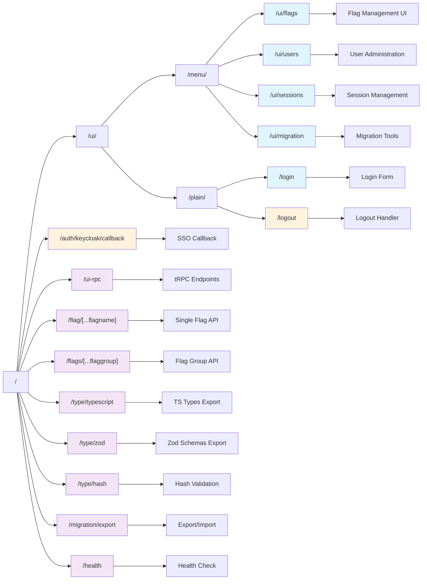
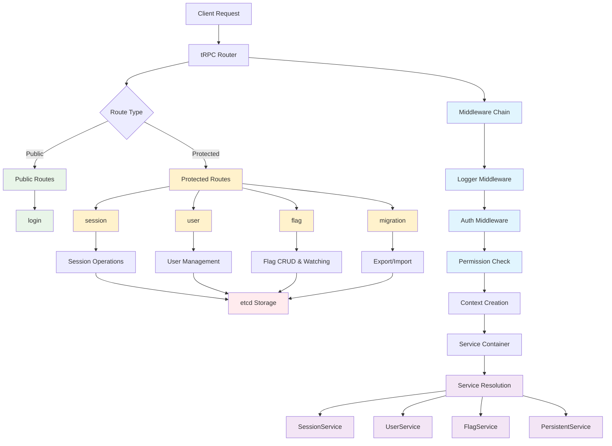
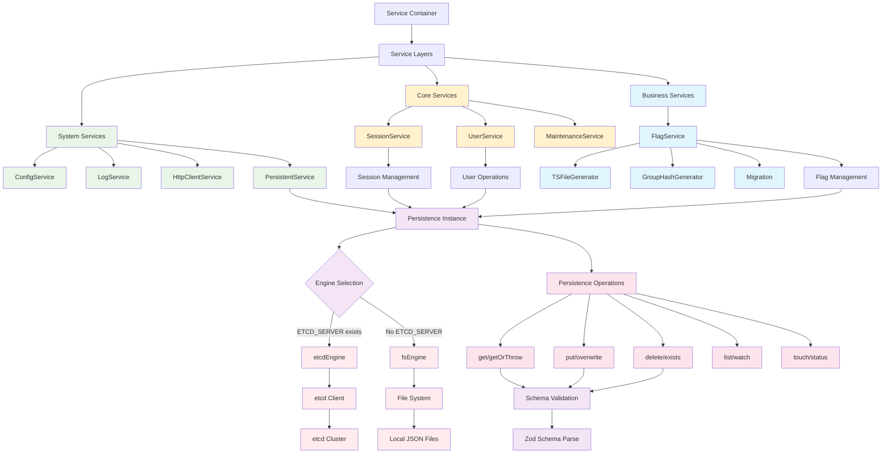

# FlagFlow

[](https://kit.svelte.dev/)
[](https://www.typescriptlang.org/)
[](https://tailwindcss.com/)
[](https://etcd.io/)
[](https://www.docker.com/)
[](https://kubernetes.io/)

A modern feature flag management system built with SvelteKit 5, TypeScript, and etcd. FlagFlow provides real-time flag management with role-based access control, type-safe client integration, and a web-based administration interface.

🌐 **Live Demo**: [demo.flagflow.net](https://demo.flagflow.net)

🌐 **Document site**: [flagflow.net](https://flagflow.net)

## Features

- **Real-time flag management** with etcd watchers
- **Type-safe integration** with TypeScript/Zod code generation
- **Role-based access control** with Keycloak authentication and JWT tokens
- **Comprehensive REST API** with OpenAPI 3.0 specification and JWT Bearer authentication
- **Enhanced user management** with password-based authentication and session lifecycle
- **Multiple flag types**: Boolean (with killswitches), Integer, String, Object, Enum, Tag, AB-Test
- **Migration system** for flag import/export between environments with REST API support
- **Web administration interface** with responsive design
- **Dual API support**: tRPC for type-safe client communication and REST API for external integrations

## Changelog

See [CHANGELOG.md](CHANGELOG.md) for detailed release notes and version history.

## Prerequisites

- Node.js 22+
- Docker (for infrastructure dependencies)

## Quick Start

### 1. Infrastructure Setup

Start the required services using the provided scripts:

```bash
# Start etcd (distributed key-value store)
./infra/etcd.sh

# Start Keycloak (authentication provider)
./infra/keycloak.sh
```

These scripts will run:

- **etcd** on port 2379 (root password: `flagflow`)
- **Keycloak** on port 8080 (admin credentials: `admin`/`admin`)

### 2. Environment Configuration

Copy the example environment file and configure:

```bash
cp .env.example .env
```

### Configuration Options

#### Core Settings

- `LOGLEVEL`: Logging level (default: `info`)
  - Options: `trace`, `debug`, `info`, `warn`, `error`
- `ENVIRONMENT`: Environment identifier (e.g., `DEV`, `STAGING`, `PROD`)

#### Database (etcd) Configuration

- `ETCD_SERVER`: etcd connection string (default: empty, means filesystem used)
- `ETCD_USERNAME`: etcd username (e.g., `root`)
- `ETCD_PASSWORD`: etcd password
- `ETCD_NAMESPACE`: etcd namespace (default: `default`)

#### Authentication (Keycloak) Configuration

- `KEYCLOAK_HOST`: Keycloak server URL (e.g., `http://localhost:8080/`)
- `KEYCLOAK_REALM`: Keycloak realm (default: `master`)
- `KEYCLOAK_CLIENT`: Keycloak client ID (default: `flagflow-frontend`)

#### Session Management

- `SESSION_USERS_ENABLED`: Enable built-in user sessions (default: `true`)
- `SESSION_DEFAULT_USERNAME`: Default user username for auto-creation
- `SESSION_DEFAULT_PASSWORD`: Default user password for auto-creation
- `SESSION_TIMEOUT_SEC`: Session timeout in seconds (default: `1800` = 30 minutes)

#### Migration & Import/Export

- `MIGRATION_SOURCE_ENVIRONMENT`: Source environment name for migrations
- `MIGRATION_SOURCE_URL`: Source URL for flag export/import operations

#### Monitoring & Development

- `METRICS_ENABLED`: Enable Prometheus metrics (default: `false`)
- `DEV_RPC_SLOWDOWN_MS`: Artificial RPC delay for development (default: `0`)

### 3. Install Dependencies

```bash
npm install
```

### 4. Start Development Server

```bash
npm run dev
```

The application will be available at `http://localhost:5173`

## Development Commands

| Command                | Description                                         |
| ---------------------- | --------------------------------------------------- |
| `npm run dev`          | Start development server with formatted logs        |
| `npm run dev-rawlog`   | Start development server with raw logs              |
| `npm run build`        | Build for production                                |
| `npm run preview`      | Preview production build                            |
| `npm run test`         | Run test suite                                      |
| `npm run ts:check`     | TypeScript type checking                            |
| `npm run lint:check`   | Check linting rules                                 |
| `npm run lint:fix`     | Auto-fix linting issues                             |
| `npm run format:check` | Check code formatting                               |
| `npm run format:fix`   | Auto-fix code formatting                            |
| `npm run all`          | Run full pipeline (format, lint, type-check, build) |

## Docker Deployment

### Build Docker Image

```bash
npm run docker:build
```

### Run Docker Container

```bash
npm run docker:run
```

The container runs on port 3000 and requires an `.env` file for configuration.

## Route Structure



## RPC Architecture



## Service & Persistence Architecture



## Architecture

FlagFlow follows a layered service architecture with dependency injection:

### Technology Stack

- **Frontend**: SvelteKit 5 with TypeScript
- **Database**: etcd (distributed key-value store)
- **Authentication**: Keycloak with JWT and password-based authentication
- **API**: Dual API support - tRPC for type-safe communication and REST API with OpenAPI 3.0
- **Styling**: TailwindCSS with Flowbite components
- **Logging**: Pino with structured logging and trace ID correlation

### Service Layers

1. **System Services**: Configuration, etcd client, HTTP client, logging
2. **Core Services**: Session management, user operations, maintenance
3. **Business Services**: Feature flag management with real-time watching

### API Architecture

FlagFlow provides two complementary API interfaces:

1. **tRPC Layer**: Type-safe client-server communication with superjson transformer
   - Middleware chain: logging → authentication → permission-based authorization
   - Route organization: `public/` (login/auth) and `protected/` (flag/user/session/migration operations)
   - Enhanced Zod error formatting with detailed validation messages

2. **REST API Layer**: RESTful endpoints with OpenAPI 3.0 specification
   - Complete CRUD operations for users, sessions, flags, and migrations
   - JWT Bearer token authentication with consistent error handling
   - Server-side RPC caller for internal service communication
   - Response formatting via `$lib/Response.ts` for consistent API responses

## Flag Types

FlagFlow supports multiple flag types with runtime validation:

- **BOOLEAN**: Simple on/off toggles (can be marked as killswitches)
- **INTEGER**: Numeric values with optional min/max constraints
- **STRING**: Text values with optional pattern validation
- **OBJECT**: Complex JSON objects with Zod schema validation
- **ENUM**: Predefined list of values
- **TAG**: String tags for categorization
- **AB-TEST**: A/B testing configurations

## API Usage

### Flag Access Endpoints

```bash
# Get single flag value
GET /flag/{flagname}

# Get flags by group
GET /flags/{flaggroup}

# Get TypeScript type definitions
GET /type/typescript

# Get Zod schemas
GET /type/zod
```

### Migration Endpoints

```bash
# Export flags for backup/migration
GET /migration/export

# Health check
GET /health
```

### REST API Endpoints

FlagFlow provides a comprehensive REST API with JWT Bearer authentication. All protected endpoints require an `Authorization: Bearer <token>` header.

#### Authentication

```bash
# Login to get JWT token
POST /api/auth/login
Content-Type: application/json

{
  "username": "your_username",
  "password": "your_password"
}

# Response includes JWT token for subsequent requests
```

#### Users Management

```bash
# Get all users (requires 'users' permission)
GET /api/users
Authorization: Bearer <token>

# Get specific user
GET /api/users/{userId}
Authorization: Bearer <token>

# Create new user (requires 'users' permission)
POST /api/users
Authorization: Bearer <token>
Content-Type: application/json

# Update user (requires 'users' permission)
PUT /api/users/{userId}
Authorization: Bearer <token>

# Delete user (requires 'users' permission)
DELETE /api/users/{userId}
Authorization: Bearer <token>
```

#### Sessions Management

```bash
# Get all sessions (requires 'users' permission)
GET /api/sessions
Authorization: Bearer <token>

# Get specific session
GET /api/sessions/{sessionId}
Authorization: Bearer <token>

# Delete session (requires 'users' permission)
DELETE /api/sessions/{sessionId}
Authorization: Bearer <token>
```

#### Flags Management

```bash
# Get all flags
GET /api/flags
Authorization: Bearer <token>

# Get specific flag
GET /api/flags/{flagId}
Authorization: Bearer <token>

# Create new flag (requires 'flag-create' permission)
POST /api/flags
Authorization: Bearer <token>

# Update flag (requires appropriate flag permissions)
PUT /api/flags/{flagId}
Authorization: Bearer <token>

# Delete flag (requires 'flag-create' permission)
DELETE /api/flags/{flagId}
Authorization: Bearer <token>
```

#### Migrations

```bash
# Export flags
GET /api/migrations/export
Authorization: Bearer <token>

# Import from file (requires 'migration' permission)
PUT /api/migrations/import
Authorization: Bearer <token>
Content-Type: multipart/form-data

# Import from remote URL (requires 'migration' permission)
PATCH /api/migrations/import
Authorization: Bearer <token>
Content-Type: application/json

{
  "url": "https://remote-server/migration/export"
}
```

#### OpenAPI Documentation

```bash
# Get OpenAPI 3.0 specification
GET /api/openapi.json
```

## User Permissions & Authentication

FlagFlow includes a comprehensive role-based permission system with enhanced authentication:

### Authentication Methods

- **Keycloak SSO**: Integration with Keycloak for enterprise authentication
- **Password-based**: Built-in user authentication with secure credential handling
- **JWT Tokens**: Bearer token authentication for API access
- **Session Management**: Automatic session lifecycle with configurable TTL and cleanup

### Permission Levels

- **flag-create**: Can create, rename/move, and delete flags
- **flag-schema**: Can manage flag schemas and types
- **flag-value**: Can manage flag values and configurations
- **users**: Can add, modify, or remove users and manage sessions
- **migration**: Can restore backups or execute migrations

### Authentication Flow

1. **Login**: Users authenticate via Keycloak SSO or password-based login
2. **Token Generation**: JWT tokens issued for API access with appropriate permissions
3. **Session Management**: User sessions tracked with automatic cleanup and debounced touching
4. **Permission Validation**: Each operation validated against user's assigned permissions

## Development Notes

- All services use structured logging with trace IDs
- Real-time updates via etcd watchers ensure immediate flag propagation
- Comprehensive type safety from database to UI using Zod schemas
- Container runs maintenance tasks every 113 seconds for cleanup
- Kill switches require confirmation dialogs for critical toggles

## Infrastructure Scripts

The `infra/` folder contains Docker commands for running dependencies:

- `etcd.sh`: Runs etcd 3.6.1 with root password `flagflow`
- `keycloak.sh`: Runs Keycloak 26.2.5 in development mode

Both containers use `--network=host` for easy local development access.

## Contributing

1. Follow the existing code conventions and patterns
2. Maintain type safety from database to UI
3. Use structured logging with trace IDs
4. Always include confirmation dialogs for destructive actions
5. Run `npm run all` before committing to ensure code quality

## License

This project is licensed under the Creative Commons Attribution-NonCommercial-ShareAlike 4.0 International License. See the [LICENSE.md](LICENSE.md) file for details.

You are free to use, modify, and distribute this software for non-commercial purposes under the same license terms.
